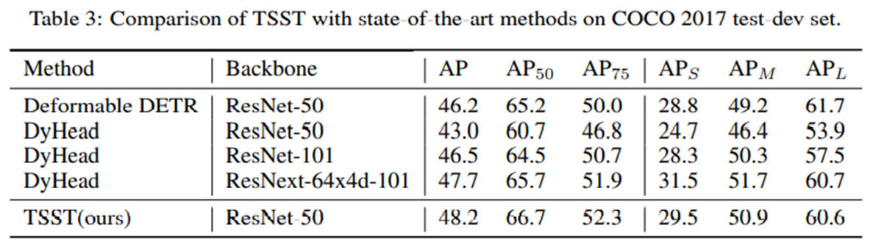

# Task Specific Attention is one more thing you need for object detection

Official Pytorch implementation of "Task Specific Attention is one more thing you need for object detection" (2022)

Sang yon Lee

@NAVER/LINE Vision
> [**Task Specific Attention is one more thing you need for object detection**](https://arxiv.org/abs/2202.09048)


## Overview
Task Specific Split Transformer(TSST) is a novel end-to-end object detection method to produce the best results without traditionally hand-designed components. By splitting generally purposed attention module into two separated mission specific attention module, the proposed method addresses the way to head into simpler object detection models.




## Model Zoo
| Config                                                                       |           Model         |   Backbone  | Scheduler | COCO mAP |  Weight                                                                                |       
|------------------------------------------------------------------------------|-------------------------|-------------|-----------|----------|----------------------------------------------------------------------------------------|                                                                                                                                                      
|  [cfg](configs/r50_tsst.sh)                                  |    Deformable DETR + TSST  |   R50       | 50 epochs        | 48.5     |  [weight](https://drive.google.com/file/d/1WwodX0srR9rJFIP5VdHvxS7KrUTHBnIM/view?usp=sharing)      |
```
# r50_ddetr_tsst_6_3_3_weight.pth

IoU metric: bbox
 Average Precision  (AP) @[ IoU=0.50:0.95 | area=   all | maxDets=100 ] = 0.485
 Average Precision  (AP) @[ IoU=0.50      | area=   all | maxDets=100 ] = 0.671
 Average Precision  (AP) @[ IoU=0.75      | area=   all | maxDets=100 ] = 0.524
 Average Precision  (AP) @[ IoU=0.50:0.95 | area= small | maxDets=100 ] = 0.311
 Average Precision  (AP) @[ IoU=0.50:0.95 | area=medium | maxDets=100 ] = 0.514
 Average Precision  (AP) @[ IoU=0.50:0.95 | area= large | maxDets=100 ] = 0.631
 Average Recall     (AR) @[ IoU=0.50:0.95 | area=   all | maxDets=  1 ] = 0.374
 Average Recall     (AR) @[ IoU=0.50:0.95 | area=   all | maxDets= 10 ] = 0.637
 Average Recall     (AR) @[ IoU=0.50:0.95 | area=   all | maxDets=100 ] = 0.702
 Average Recall     (AR) @[ IoU=0.50:0.95 | area= small | maxDets=100 ] = 0.529
 Average Recall     (AR) @[ IoU=0.50:0.95 | area=medium | maxDets=100 ] = 0.743
 Average Recall     (AR) @[ IoU=0.50:0.95 | area= large | maxDets=100 ] = 0.874
```

## Installation

### Requirements

* Linux, CUDA>=9.2, GCC>=5.4
  
* Python>=3.7

    We recommend you to use Anaconda to create a conda environment:
    ```bash
    conda create -n tsst python=3.7 pip
    ```
    Then, activate the environment:
    ```bash
    conda activate tsst
    ```
  
* PyTorch>=1.5.1, torchvision>=0.6.1 (following instructions [here](https://pytorch.org/))

    For example, if your CUDA version is 9.2, you could install pytorch and torchvision as following:
    ```bash
    conda install pytorch=1.5.1 torchvision=0.6.1 cudatoolkit=9.2 -c pytorch
    ```
  
* Other requirements
    ```bash
    pip install -r requirements.txt
    ```

### Compiling CUDA operators
```bash
cd ./models/ops
sh ./make.sh
# unit test (should see all checking is True)
python test.py
```

## Usage

### Dataset preparation

Please download [COCO 2017 dataset](https://cocodataset.org/) and organize them as following:

```
code_root/
└── data/
    └── coco/
        ├── train2017/
        ├── val2017/
        └── annotations/
        	├── instances_train2017.json
        	└── instances_val2017.json
```
### Train
```
## train TSST with r50 backbone
$ source tools/run_train.sh r50
```
### Test Evaluation(COCO minival)
```
## evaluatio coco with r50 backbone
$ source tools/run_test_coco.sh r50
```
## Citation
If you find *TSST* useful in your project, please consider to cite the following paper.

```
@misc{lee2022task,
      title={Task Specific Attention is one more thing you need for object detection}, 
      author={Sang Yon Lee},
      year={2022},
      eprint={2202.09048},
      archivePrefix={arXiv},
      primaryClass={cs.CV}
}
```
## License
```
Copyright 2022-present NAVER Corp.

Licensed under the Apache License, Version 2.0 (the "License");
you may not use this file except in compliance with the License.
You may obtain a copy of the License at

    http://www.apache.org/licenses/LICENSE-2.0

Unless required by applicable law or agreed to in writing, software
distributed under the License is distributed on an "AS IS" BASIS,
WITHOUT WARRANTIES OR CONDITIONS OF ANY KIND, either express or implied.
See the License for the specific language governing permissions and
limitations under the License.
```
